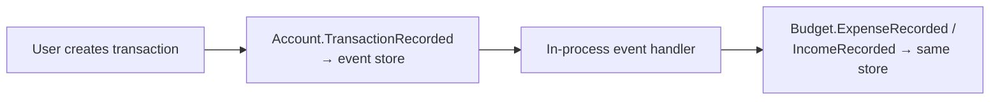

# Budgeteer - Quick Start

## Run It

From the solution root (`C:\repos\private\Budgeteer`):

```powershell
dotnet restore
dotnet build
cd Budgeteer.AppHost
dotnet run
```

- **App**: http://localhost:5000
- **Aspire Dashboard**: http://localhost:15000

Aspire starts the PostgreSQL container(s) and the Blazor web app. See
[GETTING-STARTED.md](GETTING-STARTED.md) for a guided first run and [README.md](README.md) for the
full feature tour.

## Project Layout

```
Budgeteer/
├── Budgeteer.sln
├── Budgeteer.AppHost/          → Aspire orchestrator
├── Budgeteer.ServiceDefaults/  → Observability setup
├── Budgeteer.Shared/           → Domain events (cross-domain)
├── Budgeteer.Accounts/         → Account domain + aggregates
├── Budgeteer.Budget/           → Budget domain + aggregates
├── Budgeteer.SearchMcp/        → MCP server (web_search tool)
└── Budgeteer.Web/              → Blazor UI + AI advisor
```

## Architecture Highlights

**One event store, two domains:** both the Account and Budget modules append to a single Marten
store on PostgreSQL (`accounts-eventstore`).

**Event Flow:**


**AI advisor:** the `/advisor` page is a MAF + Claude chat assistant grounded in your read models,
with web search served by the `Budgeteer.SearchMcp` MCP server. Set `ANTHROPIC_API_KEY` (and
optionally `TAVILY_API_KEY`) to enable it.
