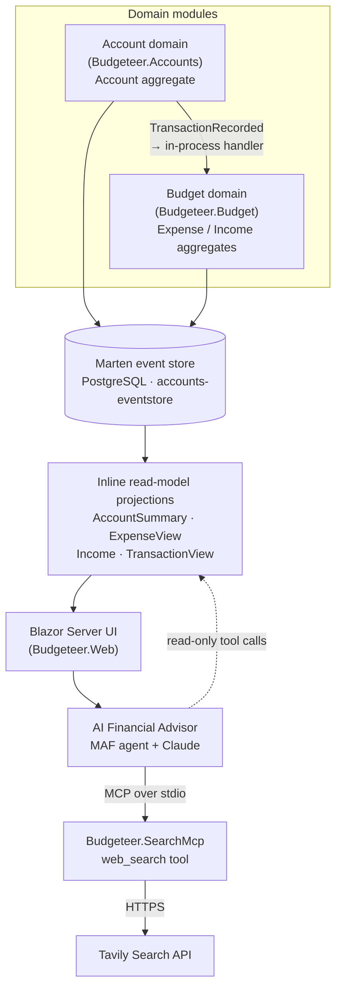
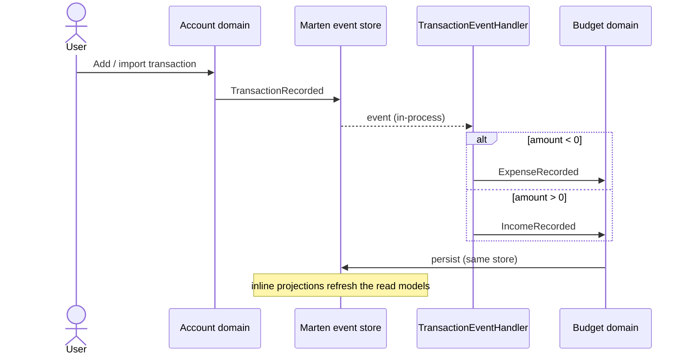
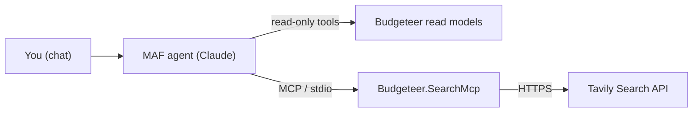

# Budgeteer - Event-Sourced Personal Finance Application

A personal budgeting application demonstrating **Domain-Driven Design** with **Event Sourcing** and **.NET Aspire** orchestration.

## 🏗️ Architecture Overview

### Two Domains, One Event Store

The codebase keeps two clearly separated domain modules (Accounts and Budget), but both
append to a **single Marten event store** on PostgreSQL (`accounts-eventstore`). An in-process
handler turns account activity into budget events, and inline projections keep the read models
that the UI and the AI advisor query.



### Domain Separation

#### **Account Domain** (`Budgeteer.Accounts`)
- **Responsibility**: Source of truth for bank accounts and raw transactions
- **Aggregates**: `Account`
- **Events**: 
  - `AccountCreated`
  - `TransactionRecorded`
  - `TransactionDeleted`
- **Event Store**: PostgreSQL (`accounts-eventstore`)

#### **Budget Domain** (`Budgeteer.Budget`)
- **Responsibility**: Categorization, budgeting, and expense tracking
- **Aggregates**: `Expense`, `Income`
- **Events**:
  - `ExpenseRecorded`
  - `IncomeRecorded`
  - `ExpenseCategorized`
  - `IncomeCategorized`
- **Event Store**: shares the single Marten store (`accounts-eventstore`)

### Event Flow



## 🔒 Security Model — Local, Single-User Only

**Budgeteer has no authentication.** It is designed to run on your own machine for a single
user. Every page — and the `/export/transactions.csv` endpoint, which returns your entire
financial history — is reachable by anyone who can reach the web server.

- Run it on `localhost` only (the default launch profiles do). `AllowedHosts` is restricted
  to localhost as an extra guard, but that is host-header filtering, not authentication.
- **Do not** bind it to a LAN/public interface, port-forward it, or deploy it anywhere shared
  without first adding ASP.NET Core authentication and `RequireAuthorization()` on the
  Razor components and the export endpoint.

## 🚀 Getting Started

### Prerequisites

- .NET 9 SDK
- Docker Desktop (for PostgreSQL via Aspire)
- IDE (Visual Studio 2022, Rider, or VS Code)
- *(optional)* an Anthropic API key for the AI advisor, and a Tavily key for its web search

### Running the Application

```bash
# From the solution root
cd Budgeteer.AppHost
dotnet run
```

Aspire will:
- Start a PostgreSQL container for the event store
- Start Blazor web application
- Open Aspire dashboard at http://localhost:15000

### First Steps

1. Navigate to **Accounts** page
2. Create your first bank account (e.g., "Checking")
3. Go to **Transactions** and add transactions
4. Watch Budget domain automatically process expenses/income

## 📂 Project Structure

```
Budgeteer/
├── Budgeteer.sln
│
├── Budgeteer.AppHost/              # .NET Aspire orchestrator
│   ├── Program.cs                  # Configures PostgreSQL + Web app
│   └── Budgeteer.AppHost.csproj
│
├── Budgeteer.ServiceDefaults/      # Aspire service defaults
│   └── Extensions.cs               # OpenTelemetry, health checks
│
├── Budgeteer.Shared/               # Cross-domain contracts
│   └── Events/
│       ├── Accounts/
│       │   └── AccountEvents.cs    # Account domain events
│       └── Budget/
│           └── BudgetEvents.cs     # Budget domain events
│
├── Budgeteer.Accounts/             # Account Domain
│   └── Domain/
│       └── Account.cs              # Account aggregate
│
├── Budgeteer.Budget/               # Budget Domain
│   ├── Domain/
│   │   └── Expense.cs              # Expense aggregate
│   └── EventHandlers/
│       └── TransactionEventHandler.cs  # Subscribes to Account events
│
├── Budgeteer.SearchMcp/            # MCP server (stdio) exposing a web_search tool
│   ├── Program.cs                  # Hosts the MCP server
│   └── WebSearchTools.cs           # Tavily-backed web_search tool
│
└── Budgeteer.Web/                  # Blazor Server UI
    ├── Components/
    │   ├── Pages/
    │   │   ├── Home.razor
    │   │   ├── Accounts.razor
    │   │   ├── Transactions.razor
    │   │   └── Advisor.razor       # AI advisor chat page
    │   └── Layout/
    ├── Services/
    │   └── Advisor/                # MAF agent, its read-only tools, MCP client
    ├── Program.cs                  # Configures the single Marten store + DI
    └── Budgeteer.Web.csproj
```

## 📥 Importing Bank Mutations (CSV)

Budgeteer imports transaction exports from **KNAB** and **Rabobank**.

1. Start the app (see *Running the Application*) and open the **Import CSV** page.
2. Choose a `.csv` file exported from your bank. Leave the format on **Auto-detect**
   (or pick KNAB / Rabobank explicitly).
3. Click **Parse** to preview the detected mutations.
4. Pick the target account — an existing one, or let Budgeteer create a new account
   from the IBAN found in the file — then click **Import**.

What happens under the hood:
- The CSV is parsed into normalized `BankMutation`s. Dutch amount formats
  (`-12,50`, `+1.500,00`) and bank-specific date formats are handled automatically.
- KNAB amounts are signed from the `CreditDebet` column; Rabobank amounts are already signed.
- Each mutation becomes a `TransactionRecorded` event on the account stream, which the
  Budget domain projects into `ExpenseRecorded` / `IncomeRecorded`.
- **Duplicates are skipped**: every row gets a stable dedup key, so re-importing the same
  (or an overlapping) export will not create duplicate transactions.

Ready-to-try example files live in [`sample-data/`](sample-data/).

### Supported formats

| Bank      | Delimiter | Amount sign        | Date format  |
|-----------|-----------|--------------------|--------------|
| KNAB      | `;`       | `CreditDebet` (C/D)| `dd-MM-yyyy` |
| Rabobank  | `,`       | signed `Bedrag`    | `yyyy-MM-dd` |

The parsers map columns by header name (with aliases), so minor column-order changes in
future exports keep working. If your bank tweaks the format, share a sample and the
relevant parser in `Budgeteer.Accounts/Import/` can be extended.

## 🏷️ Smart Categorization

Every imported (or manually added) transaction is automatically assigned a category by the
**rule engine** in `Budgeteer.Budget/Categorization/`:

- A **rule** maps a keyword to a category; it matches when the keyword appears (case-insensitively)
  in the transaction's payee or description. Highest **priority** wins, ties broken by the most
  specific (longest) keyword.
- The store ships with **default rules** for common Dutch merchants (Albert Heijn → Groceries,
  Spotify → Subscriptions, Salaris → Salary, energy/telecom → Utilities, NS → Transport, …).
  They are seeded once at startup.
- Unmatched income falls back to **Income**; unmatched expenses stay **Uncategorized**.

It's **self-learning**: on the **Budget** page, changing a transaction's category creates a
*learned* rule for that payee (higher priority than the defaults), so the next import from the
same payee is categorized automatically. Manage all rules on the **Categories** page.

The **Budget** page also shows income vs. expenses and a spending-by-category breakdown.

## 🎯 Allocations, Transfers & Goals

- **Budget allocations** — set a monthly spending limit per category on the **Budget** page. Each
  category shows spent-vs-limit with a colour-coded progress bar (green / amber near limit / red over)
  and the remaining amount. Limits are stored as `BudgetAllocation` documents.
- **Transfer detection** — money moved between *your own* accounts is detected by pairing opposite,
  equal-amount transactions whose counterparty IBAN references another owned account (within a few
  days). Detected pairs (`TransferLink`) are excluded from income, expenses and spending, and are
  tagged **Transfer** in the transaction list. Detection runs automatically after an import and via
  the **Detect transfers** button on the Budget page.
- **Saving goals** — on the **Goals** page, set a target amount and optional date, tracked either by a
  linked account's balance or a manually-updated amount. Each goal shows progress and, when dated, the
  €/month needed to hit the target. Top goals also appear on the dashboard.

## 📈 Dashboard & Filtering

The home page is a **dashboard**: total balance across accounts, all-time income / expenses / net,
a monthly cash-flow breakdown, top spending categories, per-account balances, and recent transactions.

Both list views are filterable:
- **Transactions** — filter by account, date range, category (including *Uncategorized*),
  flow (income / expenses), and a free-text search over description & payee. The header shows the
  count and net total of the current selection.
- **Budget** — scope the totals and spending-by-category to a **date range** (or "All time").

The filtering logic lives in `Budgeteer.Web/Services/TransactionQueryService.cs` (a pure, unit-tested
`Apply` method) and joins account-domain transactions with their current budget category.

## 🗂️ Read Models (Projections)

Queries hit **Marten projections** (read models) maintained *inline* as events are appended —
no full event-store replay per page load. The read models are deliberately separate from the
command-side aggregates so they stay clean projection targets (only `Apply` methods):

| Read model | Source events | Built by |
|------------|---------------|----------|
| `AccountSummary` (`Budgeteer.Accounts/ReadModels`) | `AccountCreated`, `TransactionRecorded` | inline snapshot |
| `ExpenseView` (`Budgeteer.Budget/ReadModels`) | `ExpenseRecorded`, `ExpenseCategorized` | inline snapshot |
| `Income` (`Budgeteer.Budget/Domain`) | `IncomeRecorded` | inline snapshot |
| `TransactionView` (`Budgeteer.Accounts/ReadModels`) | `TransactionRecorded` | `EventProjection` (one doc per transaction) |

The write side still uses the `Account` / `Expense` aggregates (with their factory/business
methods) for command handling via `AggregateStreamAsync` and `StartStream`. Because those
aggregates carry methods that *return events*, they aren't used as projection targets directly —
the dedicated read models above are. The transaction list joins `TransactionView` with the current
category from `ExpenseView` / `Income` at query time, so re-categorizations are always reflected.

> Note: read models are populated as events are appended. An existing event store should have its
> projections rebuilt once (`store.Advanced.RebuildProjectionAsync<T>()`) after upgrading.

## 🧰 Managing & Analyzing Your Data

- **Edit / undo / delete** — delete a transaction (a `TransactionDeleted` event reverses the balance,
  frees its import key, and removes the derived budget/transfer records), delete a whole account, or
  **undo the last import** as a unit (each import is tracked as an `ImportBatch`). Editing a
  transaction replaces it (and re-categorizes) in one transaction. All destructive actions confirm first.
- **Reports** (`/reports`) — month-over-month cash flow (12 months), spending-by-category with
  click-to-drill-down into the underlying transactions, and a recurring-payments section. A
  **CSV export** of all transactions is available at `/export/transactions.csv`.
- **Statement reconciliation** — when an export carries a running balance (Rabobank's "Saldo na trn"),
  the Import page verifies the balances form a continuous chain and warns if a transaction looks
  **missing or duplicated**.
- **Recurring / subscription detection** — payments that repeat on a regular cadence (weekly / monthly
  / quarterly / yearly) from the same payee are surfaced on Reports with the typical amount, next
  expected date, and a flag when the latest charge changed.

## 🤖 AI Financial Advisor

The **Advisor** page (`/advisor`) is a chat assistant that answers questions about *your* money —
"where does my money go?", "am I overspending?", "is there a cheaper alternative to this bill?".
It is built on the **Microsoft Agent Framework (MAF)** with **Claude** as the model (MAF's
first-party Anthropic provider).

- **Grounded in your data** — the agent never invents figures. It calls read-only tools
  (`Budgeteer.Web/Services/Advisor/FinancialAdvisorTools.cs`) that wrap the existing read models:
  balances, spending-by-category, budget status & month-end projection, saving goals, recurring
  payments, cash-flow trend, largest transactions, spend-for-payee, category drill-down, and
  unusual / uncategorized transactions.
- **Web research over MCP** — a separate **Model Context Protocol** server, `Budgeteer.SearchMcp`,
  exposes a `web_search` tool (backed by the [Tavily](https://tavily.com) API). The advisor connects
  to it over stdio, so it can look up real-world options — e.g. read your recurring Vodafone charge,
  search for cheaper Dutch SIM-only plans, and estimate the annual saving.
- **Graceful by default** — with no `ANTHROPIC_API_KEY` the page shows a setup notice instead of
  failing; with no Tavily key the advisor still answers from your data and just can't search the web.



**Enabling it:** set `ANTHROPIC_API_KEY` (or config `Anthropic:ApiKey`); the model defaults to
`claude-opus-4-8` (override with `Anthropic:Model`). For web search, set `TAVILY_API_KEY` (or config
`Tavily:ApiKey`).

## 🎯 Key Design Decisions

### Why a Single Event Store (with separate domains)?

The Accounts and Budget domains stay separate as **code modules** (own aggregates, events, and read
models), but share one Marten store for simplicity:

1. **Domain Isolation**: Each domain owns its aggregates, events, and read models
2. **Simple Operations**: One database to provision, back up, and migrate for the MVP
3. **Clear Boundaries**: Cross-domain flow is explicit, via the in-process event handler
4. **Room to Grow**: The module boundaries leave the door open to split into separate stores
   (or services) later without reshaping the domain code

### Why Marten?

- Built on PostgreSQL (production-ready, SQL queries)
- Native event sourcing support
- Excellent projection capabilities
- Strong .NET community

### Why Aspire?

- **Local Development**: Zero-friction PostgreSQL setup
- **Observability**: Built-in telemetry and tracing
- **Service Discovery**: Easy cross-service communication
- **Production Ready**: Same patterns scale to deployment

## 📊 Event Sourcing Benefits

### Audit Trail
Every financial change is recorded as an immutable event

### Time Travel
Reconstruct account state at any point in time

### Event Replay
Rebuild Budget domain from Account events for disaster recovery

## 🔄 Next Steps

### Phase 1 (Current - MVP)
- ✅ Event store on PostgreSQL with Aspire orchestration
- ✅ Account domain with basic CRUD
- ✅ Budget domain event handler
- ✅ Blazor UI for accounts and transactions
- ✅ CSV import (KNAB & Rabobank bank exports)
- ✅ Smart (rule-based, self-learning) categorization
- ✅ Budget allocation (per-category monthly limits)
- ✅ Transfer detection between own accounts
- ✅ Saving / financial goals
- ✅ Edit / undo / delete (transactions, accounts, imports)
- ✅ Reports, CSV export, statement reconciliation, recurring detection
- ✅ AI financial advisor (MAF + Claude) with MCP-backed web search

### Phase 2 (Future)
- Add message broker (RabbitMQ/Redis)
- ✅ Projections / read models (inline Marten projections)
- ✅ Budget planning features (allocations + saving goals)
- ✅ Transfer detection between accounts
- Advanced reporting

### Phase 3 (Advanced)
- Separate microservices
- API layer
- Mobile app (MAUI)
- Multi-user support

## 🛠️ Technologies

- **.NET 9** - Modern C#
- **Blazor Server** - Interactive web UI
- **Marten** - Event sourcing on PostgreSQL
- **.NET Aspire** - Cloud-ready app orchestration
- **Microsoft Agent Framework + Claude** - AI financial advisor
- **Model Context Protocol (MCP)** - `web_search` tool server
- **Bootstrap 5** - UI styling

## 📝 Development Notes

### Querying Events

```csharp
// All events in a stream
var events = await session.Events.FetchStreamAsync(streamId);

// Project to current state
var account = await session.Events.AggregateStreamAsync<Account>(streamId);

// Query all events
var allEvents = await session.Events.QueryAllRawEvents().ToListAsync();
```

### Debugging Event Flows

1. Open Aspire Dashboard: http://localhost:15000
2. View traces to see event propagation
3. Check PostgreSQL logs in containers

---

**Built with ❤️ as an event sourcing learning project**
